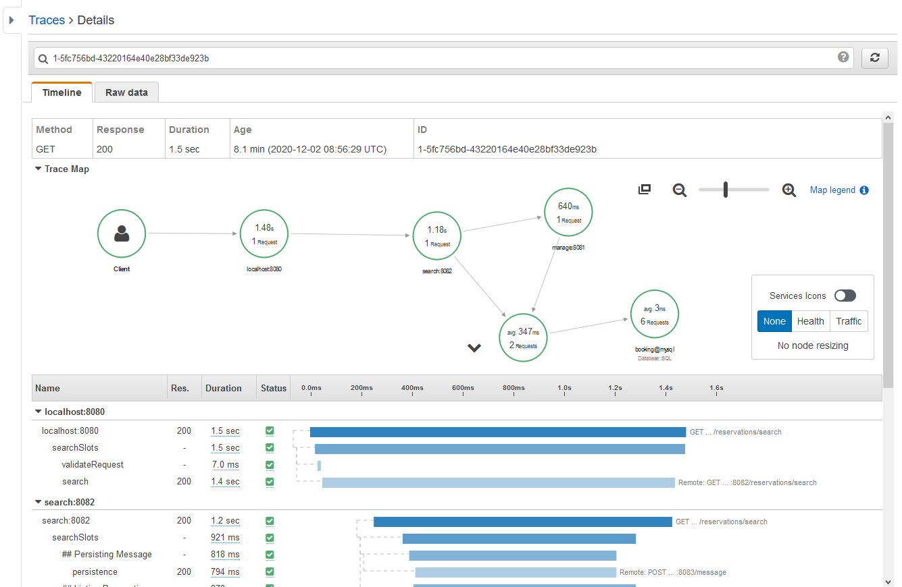

# springboot_xray

This repository shows how [AWS X-Ray](https://aws.amazon.com/xray/) can be integrated with Springboot microservices in order to track requests and trace the application flow not only on the individual service but accross the all microservices involved.

To build:
```bash
$ ./gradlew clean build
```

To generate the docker images:
```bash
$ ./gradlew frontend_service:docker persistence_service:docker booking_services:manage_service:docker booking_services:search_service:docker  # (I haven't found a way of ignoring the docker task on the root project)
```

The solution has the following flow:
```
                                                _____________________________
 ____________________________________          |                             |          ____________________________
|                                    |         |   Booking services:         |         |                            |
|  Frontend service                  |  ---->  |    ______________________   |  ---->  |  Persistence service       |
|  (request validation & routing)    |         |   | Manage reservations  |  |         |                            |
|____________________________________|         |   |______________________|  |         |____________________________|
                                               |    ______________________   |
                                               |   | Slot search          |  |
                                               |   |______________________|  |
                                               |_____________________________|
```

Docker-compose is used to deploy all the applications and the necessary resources. Check (the docker-compose file)[docker-compose.yml].
The additional components needed are: 
* [MySQL](https://hub.docker.com/_/mysql)
* [AWS X-Ray Daemon](https://docs.aws.amazon.com/xray/latest/devguide/xray-daemon.html), which forwards the traces sent by our springboot app to AWS

Before starting the stack, the X-Ray Daemon container expects the credentials to be added on the file `xray-daemon.env`, with the following content:
```text
AWS_REGION=
AWS_ACCESS_KEY_ID=
AWS_SECRET_ACCESS_KEY=
```

To start the stack:
```bash
$ docker-compose up -d
$ docker-compose logs -f
```

Now you can invoke the application, notice that each request will return a header called `X-Amzn-Trace-Id`, this is the trace id we can use to check the invocation flow on [AWS X-Ray Console](https://docs.aws.amazon.com/xray/latest/devguide/xray-console.html):
```bash
$ curl -v -H 'x-someheader: somevalue' http://localhost:8080/reservations/search # search for reservations
> ...
> GET /reservations/search HTTP/1.1
> ...
< ...
< X-Amzn-Trace-Id: Root=1-5fc756bd-43220164e40e28bf33de923b;
< ...
["slot 1","slot 2"]%

$ curl -v -H 'x-someheader: somevalue' http://localhost:8080/reservations -d 'reservation=1234' # create new reservation
> ...
> POST /reservations HTTP/1.1
> ...
< ...
< X-Amzn-Trace-Id: Root=1-5fc756fd-568fd3271a4fd2f971c76387;
< ...
reservation=1234 - done at 1606899453377%
```

And finally you can see the entire application flow tracing on the X-Ray console:

